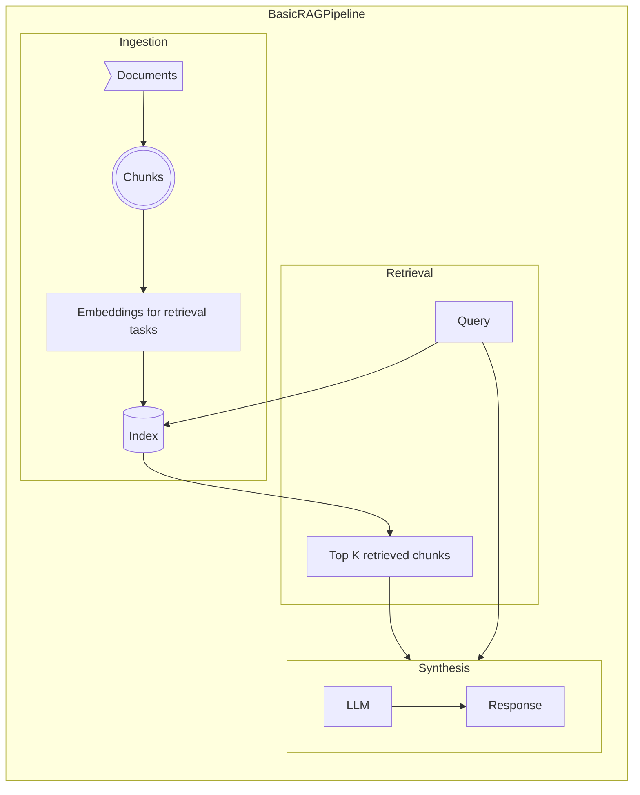
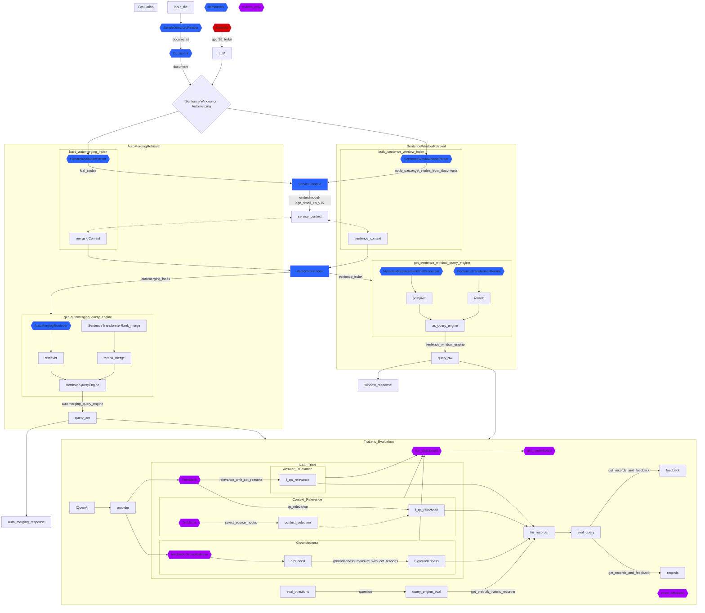

# genai-rag
Retrieval-augmented generation (RAG) is a hybrid framework that integrates retrieval and generative models to produce contextually accurate and information-rich text. It's like a supercharged researcher and writer duo.

Here's a simplified explanation of the RAG pipeline:

1. **Document Ingestion**: This process occurs offline. The retriever component of RAG searches through a vast corpus of text to find relevant documents.

2. **Online Query**: When an online query comes in, the retrieval of relevant documents and generating a response occurs.

3. **Retrieval of Relevant Documents**: The retriever component of RAG finds relevant documents that answer the query.

4. **Generation of Response**: The generator component uses these documents and the original query to generate a detailed and up-to-date answer.

RAG has several advantages:

- **Empowering LLM solutions with real-time data access**: AI solutions that use Large Language Models (LLMs) can remain up-to-date and current with RAG, facilitating direct access to additional data resources.
- **Preserving data privacy**: Ensuring data privacy is crucial for enterprises. With a self-hosted LLM, sensitive data can be kept on-premises.
- **Mitigating LLM hallucinations**: RAG reduces the likelihood of hallucinations by providing the LLM with relevant and factual information.

The RAG Triad evaluates Retrieval-Augmented Generation (RAG) applications to ensure they are free from hallucinations. It consists of three evaluations:

1. **Context Relevance**: This evaluates the relevance of each chunk of context to the input query. It's crucial because the context will be used by the Large Language Model (LLM) to form an answer. Any irrelevant information in the context could be woven into a hallucination.

2. **Groundedness**: This evaluates whether the context supports the response. LLMs often stray from the facts provided, exaggerating or expanding to a correct-sounding answer.

3. **Answer Relevance**: This evaluates the relevance of the final response to the user input.

By reaching satisfactory evaluations for this triad, we can make a nuanced statement about our application’s correctness; it is verified to be hallucination-free up to the limit of its knowledge base. In other words, if the vector database contains only accurate information, then the answers provided by the RAG are also accurate.

**Sentence Window Retrieval**

Sentence Window Retrieval (SWR) is an advanced technique in Retrieval-Augmented Generation (RAG) systems. Here's a simplified explanation:

1. **Sentence Embedding**: Each sentence in a document is embedded separately. This provides excellent accuracy for the query-to-context cosine distance search.

2. **Context Extension**: After fetching the most relevant single sentence, the context window is extended by a certain number of sentences (k) before and after the most pertinent sentence. This broader context is used for a more grounded generation.

The philosophy behind SWR is to retrieve a pointed context from the custom knowledge base based on the query and use a broader version for a more grounded generation. In this process, a limited set of sentences is embedded for retrieval². This approach enhances the solution’s ability to identify similarities in requests, incorporating confirmed responses as additional context to mitigate hallucinations and ensure consistent service quality².

**Retrieval Augmented Generation (RAG)** is an advanced artificial intelligence technique that combines information retrieval with text generation. It allows AI models to retrieve relevant information from a knowledge source and incorporate it into generated text1. Let’s delve into the specifics of the Auto-merging Retriever, also known as the Parent Document Retriever.

Naive RAG:

The starting point of the RAG pipeline involves a corpus of text documents. We’ll skip everything before this point, leaving it to the open-source data loaders that can connect to various sources, from YouTube to Notion.
In the Naive RAG approach, we retrieve relevant information from the corpus and use it as context for a Large Language Model (LLM) to generate answers.
However, Naive RAG has limitations, especially when dealing with long documents or complex queries.

Auto-merging Retriever:

The idea behind this technique is similar to the Sentence Window Retriever. We search for more granular information (child chunks) within documents.
The Auto-merging Retriever goes a step further. It recursively “merges” subsets of leaf nodes that reference a parent node beyond a given threshold.
It extends the context window by combining related chunks from different parts of the document.
This larger context is fed to an LLM for reasoning and text generation23.
In summary, Auto-merging Retriever enhances the context provided to the language model by consolidating potentially disparate, smaller contexts into a more comprehensive one. This approach aims to improve the quality of generated responses by incorporating relevant information from the retrieved documents23. 🤖📚

**Evaluate & Iterate**
- Iterate with different hierarchical structures (number of levels, children) and chunk sizes
- Evaluate app versions with the RAG Triad
- Track experiments to pick the best structure
- Gain intuition about hyperparameters that work best with certain doc types 
- Auto-merging is complimentary to sentence-window retrieval

**Sources:**
https://learn.deeplearning.ai/building-evaluating-advanced-rag/lesson/1/introduction
RAG:
(1) Retrieval Augmented Generation (RAG): A Comprehensive Guide. https://www.datastax.com/guides/what-is-retrieval-augmented-generation.
(2) Understanding Retrieval-Augmented Generation: A Simple Guide. https://medium.com/@amodwrites/understanding-retrieval-augmented-generation-a-simple-guide-d638ac92c123.
(3) RAG 101: Demystifying Retrieval-Augmented Generation Pipelines. https://developer.nvidia.com/blog/rag-101-demystifying-retrieval-augmented-generation-pipelines/.
(4) RAG 101: Demystifying Retrieval-Augmented Generation Pipelines. https://developer.nvidia.com/blog/rag-101-demystifying-retrieval-augmented-generation-pipelines/.
(5) Understanding Retrieval-Augmented Generation: A Simple Guide. https://medium.com/@amodwrites/understanding-retrieval-augmented-generation-a-simple-guide-d638ac92c123.
(6) RAG Pipelines From Scratch | Haystack. https://haystack.deepset.ai/blog/rag-pipelines-from-scratch.
RAG Triad:
(1) RAG Triad - TruLens. https://www.trulens.org/trulens_eval/core_concepts_rag_triad/.
(2) How to Evaluate Retrieval Augmented Generation (RAG) Applications .... https://zilliz.com/blog/how-to-evaluate-retrieval-augmented-generation-rag-applications.
(3) Evaluating Multi-modal RAGs. https://web.stanford.edu/class/cs329t/slides/lecture_16_2.pdf.
(4) undefined. https://docs.ragas.io/en/latest/concepts/testset_generation.html.
Sentence Window Retrieval:
(1) Advanced RAG Techniques: an Illustrated Overview. https://pub.towardsai.net/advanced-rag-techniques-an-illustrated-overview-04d193d8fec6.
(2) A Guide to Advanced RAG Techniques for Success in Business Landscape. https://blogs.sap.com/2023/12/22/a-guide-to-advanced-rag-techniques-for-success-in-business-landscape/.
