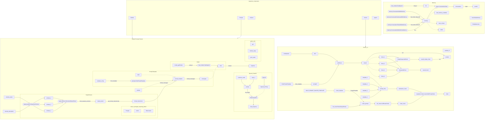

```mermaid
flowchart TD
 subgraph OpenAI_ChatAPI["OpenAI_ChatAPI"]
        ChatCompletion{{"ChatCompletion"}}
        chat_response["chat_response"]
        prompt["prompt"]
        customer_email["customer_email"]
        style_1["style_1"]
        OpenAI{{"OpenAI"}}
        OpenAI_APIKey["OpenAI_APIKey"]
  end
 subgraph OutputParsers["OutputParsers"]
        output_parsers_ResponseSchema{{"output_parsers.ResponseSchema"}}
        output_parsers_StructuredOutputParser{{"output_parsers.StructuredOutputParser"}}
        schema_1["schema_1"]
        schema_2["schema_2"]
        schema_3["schema_3"]
        format_instructions["format_instructions"]
        output_parser["output_parser"]
        chain_of_thought_reasoning_ReAct["chain_of_thought_reasoning_ReAct"]
  end
 subgraph Model["Model"]
        chat_models_ChatOpenAI{{"chat_models.ChatOpenAI"}}
        chat["chat"]
        llm_model["model_gpt35turbo"]
  end
 subgraph PromptTemplate["PromptTemplate"]
        template_string["template_string"]
        prompt_template["prompt_template"]
        customer_style["style"]
        customer_messages["messages"]
        prompts_ChatPromptTemplate{{"prompts.ChatPromptTemplate"}}
  end
 subgraph Memory["Memory"]
        mem_ChatOpenAI{{"chat_models.ChatOpenAI"}}
        chains_ConversationChain{{"chains.ConversationChain"}}
        memory_ConversationBufferMemory{{"memory.ConversationBufferMemory"}}
        llm["llm"]
        memory_ConversationTokenBufferMemory{{"memory.ConversationTokenBufferMemory"}}
        memory_ConversationSummaryMemory{{"memory.ConversationSummaryBufferMemory"}}
        memory_ConversationBufferWindowMemory{{"memory.ConversationBufferWindowMemory"}}
        predict["predict"]
        conversation["conversation"]
        memory["memory"]
        load_memory_variables["load_memory_variables"]
        save_context["save_context"]
        buffer["buffer"]
        VectorDataMemory["VectorDataMemory"]
        EntityMemories["EntityMemories"]
  end
 subgraph langchain_components["langchain_components"]
        Models["Models"]
        Prompts["Prompts"]
        Indexes["Indexes"]
        Chains["Chains"]
        Agents["Agents"]
  end
  Models & Prompts --> langchain_L1
  Chains --> Chains_L3
 subgraph langchain_L1["Models Prompts Parsers"]
        OutputParsers
        PromptTemplate
        Model
        schema_name["schema_name"]
        schema_description["schema_description"]
        service_reply["prompt"]
        customer_response["response"]
        OpenAI_ChatAPI
        python_dict["python_dict"]
  end
 subgraph chain_of_thought_reasoning_ReAct["chain_of_thought_reasoning_ReAct"]
        Thought["Thought"]
        Action["Action"]
        Observation["Observation"]
  end
 subgraph python_dict["python_dict"]
        gift["gift"]
        delivery_days["delivery_days"]
        price_value["price_value"]
  end
 subgraph Chains_L3["Chains_L3"]
        pandas_df["pandas_df"]
        ChatOpenAI  --> llm3
        ChatPromptTemplate --from_template--> prompt3
        llm3 & prompt3 --> LLMChain --> chain3
        chain3 --run--> product
        chain_1
        chain_2
        chain3 -.-> chain_1 & chain_2 & chain_3 & chain_4
        chain_1 & chain_2 --> SimpleSequentialChain --> overall_simple_chain --run--> product
        chain_1 & chain_2 & chain_3 & chain_4 --> SequentialChain --> overall_chain
        template_1 & template_2 & template_3 & template_4 --> prompt_infos --> destination_chain

        MULTI_PROMPT_ROUTER_TEMPLATE --> router_template --PromptTemplate--> router_prompt
        llm_router.LLMRouterChain --> router_chain --> langchain.chains.router.MultiPromptChain
        llm_router.RouterOutputParser --> router_prompt
        destination_chain --> langchain.chains.router.MultiPromptChain --> chain
        router_prompt --> llm_router.LLMRouterChain 
  end

    memory_ConversationBufferMemory --> memory
    memory_ConversationSummaryMemory -- max_token_limit_100 --> memory
    memory_ConversationTokenBufferMemory -- max_token_limit_50 --> memory
    memory_ConversationBufferWindowMemory -- K_1 --> memory
    memory --> chains_ConversationChain
    customer_email --> prompt
    style_1 --> prompt
    mem_ChatOpenAI -- temp_0 --> llm
    memory -.-> load_memory_variables & save_context & buffer
    llm --> chains_ConversationChain
    chains_ConversationChain --> conversation
    conversation -- input --> predict
    output_parsers_StructuredOutputParser -- from_response_schema --> output_parser
    output_parser -- get_format_instructions() --> format_instructions
    output_parsers_ResponseSchema --> schema_1 & schema_2 & schema_3
    schema_name --> output_parsers_ResponseSchema
    schema_description --> output_parsers_ResponseSchema
    schema_1 --> output_parsers_StructuredOutputParser
    schema_2 --> output_parsers_StructuredOutputParser
    schema_3 --> output_parsers_StructuredOutputParser
    prompt -- llm_model --> ChatCompletion
    llm_model -- temp_0 --> chat_models_ChatOpenAI
    OpenAI --> OpenAI_APIKey
    OpenAI_APIKey -.-> ChatCompletion
    ChatCompletion --> chat_response
    customer_style -.-> prompt_template
    chat_models_ChatOpenAI --> chat
    template_string -- from_template --> prompts_ChatPromptTemplate
    prompts_ChatPromptTemplate --> prompt_template
    prompt_template -- format_messages --> customer_messages
    customer_messages -.-> chat
    chat -- content --> customer_response
    service_reply -. format_messages .-> prompt_template
    format_instructions --> prompt_template

```
